# OpenDevin — Autonomous Code Pipeline

> From GitHub Issue to merged PR. Zero human code.

**[View Live Site](https://ricardobnjunior.github.io/opendevin-site/)** · **[Architecture Deep Dive](https://ricardobnjunior.github.io/opendevin-site/architecture.html)**

---

## What is OpenDevin?

OpenDevin is an autonomous code pipeline that receives GitHub Issues labeled `agent`, classifies the task by domain, routes to specialized agents, executes 4 cognitive phases with AI Judge validation, validates generated code inside an isolated Docker container, opens a PR, and auto-merges — with zero human supervision until review.

**Real execution result:** 8 backend issues processed in 36min 45s. 7 auto-merged. 87.5% success rate.

**Status: Advanced POC — under active development.**

---

## Key Numbers

| Metric | Value |
|--------|-------|
| Pipeline nodes | 13 (LangGraph state machine) |
| Cognitive phases | 4 (Scan > Investigate > Draft Plan > Build) |
| Quality layers | 5 (validation, security, review, regression, sanitization) |
| Failure types | 17 (typed classification with specialized fix prompts) |
| Sanitization passes | 14 (pre-commit) |
| Repair layers | 2 (pre-commit up to 5x + post-CI up to 3x) |
| Real execution | 8 issues in 36min, 87.5% auto-merge rate |

---

## Pipeline

```mermaid
flowchart TB

    ISSUE([" GitHub Issues - label: agent "]):::input

    subgraph TRIAGE_BLOCK [" TRIAGE "]
        direction TB
        TR[" Analyze issue "]:::triage
        ROUTER{" Router "}:::decision
        TR --> ROUTER
    end
    SKIP([" Skip "]):::skip

    subgraph AGENTS [" SPECIALIZED AGENTS "]
        direction LR
        AG_BE[" Backend "]:::agent
        AG_FE[" Frontend "]:::agent
        AG_AI[" AI Systems "]:::agent
        AG_DB[" Database "]:::agent
        AG_MX[" Mixed "]:::agent
    end

    subgraph MODE_E [" MODE 1: SCAN "]
        E1[" Read issue + map codebase "]:::scan
    end
    EJ{" Judge "}:::judge

    subgraph MODE_R [" MODE 2: INVESTIGATE "]
        R1[" Web research + analyze complexity "]:::investigate
    end
    RJ{" Judge "}:::judge

    subgraph MODE_P [" MODE 3: DRAFT PLAN "]
        P1[" Architecture + TODO list "]:::draft_plan
    end
    PJ{" Judge "}:::judge

    subgraph MODE_I [" MODE 4: BUILD "]
        I1[" Generate code + tests "]:::build
    end
    IJ{" Judge "}:::judge

    subgraph QA_BLOCK [" QUALITY ASSURANCE "]
        direction TB
        SAN[" Commit Sanitizer "]:::quality
        VAL[" Docker Validator - Syntax - Imports - Pytest - SAST "]:::quality
        SAN --> VAL
    end
    QR{" Passed? "}:::decision
    FIX[" Auto-Fix - up to 5x "]:::autofix

    REV[" Code Review - LLM "]:::review
    RR{" Approved? "}:::decision

    subgraph DELIVERY [" DELIVERY "]
        direction TB
        COMMIT[" Commit + PR "]:::delivery
        CI[" CI - GitHub Actions "]:::delivery
        COMMIT --> CI
    end
    CIR{" CI Passed? "}:::decision
    CIFIX[" CI Repair - up to 3x "]:::autofix

    MERGE([" Auto-Merge "]):::output
    HUMAN([" Human Review "]):::human

    ISSUE --> TRIAGE_BLOCK
    TR -->|no| SKIP
    ROUTER -->|backend| AG_BE
    ROUTER -->|frontend| AG_FE
    ROUTER -->|ai_systems| AG_AI
    ROUTER -->|database| AG_DB
    ROUTER -->|mixed| AG_MX

    AG_BE & AG_FE & AG_AI & AG_DB & AG_MX --> MODE_E

    MODE_E --> EJ
    EJ -->|Approved| MODE_R
    EJ -->|Rejected| MODE_E

    MODE_R --> RJ
    RJ -->|Approved| MODE_P
    RJ -->|Rejected| MODE_R

    MODE_P --> PJ
    PJ -->|Approved| MODE_I
    PJ -->|Rejected| MODE_P

    MODE_I --> IJ
    IJ -->|Approved| QA_BLOCK
    IJ -->|Rejected| MODE_I

    VAL --> QR
    QR -->|yes| REV
    QR -->|no| FIX
    FIX -->|retry| SAN
    FIX -->|exhausted| HUMAN

    REV --> RR
    RR -->|PASS| DELIVERY
    RR -->|FAIL| FIX

    CI --> CIR
    CIR -->|passed| MERGE
    CIR -->|failed| CIFIX
    CIFIX -->|retry| CI
    CIFIX -->|exhausted| HUMAN

    classDef input fill:#e94560,stroke:#c23152,color:#fff,font-weight:bold
    classDef skip fill:#6b7280,stroke:#4b5563,color:#fff
    classDef triage fill:#2563eb,stroke:#1d4ed8,color:#fff
    classDef decision fill:#1e40af,stroke:#1e3a8a,color:#fff,font-weight:bold
    classDef agent fill:#3b82f6,stroke:#2563eb,color:#fff
    classDef scan fill:#0ea5e9,stroke:#0284c7,color:#fff
    classDef investigate fill:#8b5cf6,stroke:#7c3aed,color:#fff
    classDef draft_plan fill:#a855f7,stroke:#9333ea,color:#fff
    classDef build fill:#22c55e,stroke:#16a34a,color:#fff
    classDef judge fill:#f97316,stroke:#ea580c,color:#fff,font-weight:bold
    classDef quality fill:#0ea5e9,stroke:#0284c7,color:#fff
    classDef review fill:#8b5cf6,stroke:#7c3aed,color:#fff
    classDef autofix fill:#ef4444,stroke:#dc2626,color:#fff
    classDef delivery fill:#2563eb,stroke:#1d4ed8,color:#fff
    classDef output fill:#10b981,stroke:#059669,color:#fff,font-weight:bold
    classDef human fill:#f97316,stroke:#ea580c,color:#fff,font-weight:bold
```

---

## How It Works

### 1. Triage + Routing

The orchestrator reads issues labeled `agent` from GitHub. The **triage** node evaluates if the issue is processable. The **router** classifies it by domain (backend, frontend, database, ai_systems, mixed) and defines allowed file paths.

### 2. CORE Framework (4 cognitive phases)

Each issue passes through 4 sequential phases, each validated by an **AI Judge** (PASS / CONCERNS / REWORK / FAIL, up to 3 retries):

| Phase | What the agent does |
|-------|-------------------|
| **Scan** | Reads the issue + maps codebase via RAG (ChromaDB) and file search |
| **Investigate** | Web search (Tavily/SearXNG) + analyzes complexity + checks duplication |
| **Draft Plan** | Defines architecture, TODO list, file structure |
| **Build** | Generates code + tests in batches (up to 5 batches, 15 files each) |

### 3. Quality Gates (5 layers)

| Layer | Pipeline node | What it checks |
|-------|-------------|----------------|
| Code validation | `validate` (qa_node) | AST syntax, imports, pytest + coverage, truncation detection |
| Security scan | `security` | Bandit (Python) + Semgrep (semantic patterns) |
| LLM code review | `review` | Quality, ticket adherence, scope drift, over-engineering |
| Incremental regression | Inside `validate` | Blocks if >20% of code elements are lost |
| Pre-commit sanitization | Inside `commit` | 14 passes: smart merge, lint auto-fix, import correction |

### 4. Repair Loop (2 layers)

**Pre-commit**: Typed failure classification (17 `FailureType` enum values) routes to specialized fix prompts. Up to 5 attempts with convergence detection.

**Post-CI**: Reads real GitHub Actions logs, LLM generates fix, new commit. Up to 3 attempts. Escalates to human review if it doesn't converge.

### 5. Delivery

Atomic commit via Git Trees API, branch, PR linked to issue. CI gate monitors GitHub Actions. Classification: `auto-approve` or `needs-review`. Memory saves patterns for future issues.

---

## Tech Stack

| Layer | Technology |
|-------|-----------|
| LLM Provider | OpenRouter (multi-model) |
| Models | DeepSeek v3 (generation), Gemini 2.5 Flash (judge), Claude Sonnet (fallback) |
| Framework | LangGraph (state machine), LangChain Core |
| Code analysis | Tree-sitter (Python/JS/TS), AST |
| Security | Bandit, Semgrep |
| Web search | Tavily API + SearXNG |
| Code quality | ruff (lint), pytest (tests), coverage |
| Semantic search | ChromaDB (RAG) |
| Web API | FastAPI + Uvicorn + SSE |
| Frontend | React + TypeScript + Vite |
| Git | ghapi (GitHub API wrapper) |
| CI/CD | GitHub Actions (cron + webhook) |
| Containers | Docker + Docker Compose (5 services) |
| Observability | LangFuse (tracing + tokens) |

---

## Pages in This Site

| Page | Description |
|------|-------------|
| [`index.html`](https://ricardobnjunior.github.io/opendevin-site/) | Product landing page — hero, stats, pipeline overview, agents, CORE phases, QA, real execution data, tech stack, full architecture diagram, known limitations |
| [`architecture.html`](https://ricardobnjunior.github.io/opendevin-site/architecture.html) | Architecture deep dive — full Mermaid flowchart, CORE phases table, QA table, auto-fix details per issue, known limitations |

Both pages are self-contained HTML with dark theme, Mermaid.js diagrams, and responsive layout. No external dependencies beyond Mermaid CDN.

---

## Real Execution Data

The site includes real execution data from processing 8 backend issues on [`ricardobnjunior/content-api`](https://github.com/ricardobnjunior/content-api):

| Issue | Title | Files | Auto-Fix | Result | Time |
|-------|-------|-------|----------|--------|------|
| #1 | Backend scaffolding — FastAPI + SQLite | 14 | 0 | Auto-merged | 2m 59s |
| #2 | Articles CRUD — model, schemas, endpoints | 11 to 17 | 5 (converged) | Auto-merged | 8m 07s |
| #3 | Categories with article relationship | 12 to 19 | 1 | Auto-merged | 5m 04s |
| #4 | Search and pagination with filters | 4 to 18 | 5 (failed) | Human Review | 6m 21s |
| #5 | Image upload for articles | 19 | 1 | Auto-merged | 5m 36s |
| #24 | AI category suggestion — LLM classifier | 8 | 0 | Auto-merged | 3m 40s |
| #26 | Statistics and analytics endpoints | 3 | 0 | Auto-merged | 2m 28s |
| #27 | Export articles — CSV and JSON download | 2 | 0 | Auto-merged | 2m 24s |

**Total: 36min 45s | 7/8 auto-merged | 87.5% success rate**

---

## Author

**Ricardo Neves Jr.**

- GitHub: [ricardobnjunior](https://github.com/ricardobnjunior)
- LinkedIn: [ricardo-neves-junior](https://www.linkedin.com/in/ricardo-neves-junior/)

---

*Advanced POC | Not production ready | Open for collaboration*
